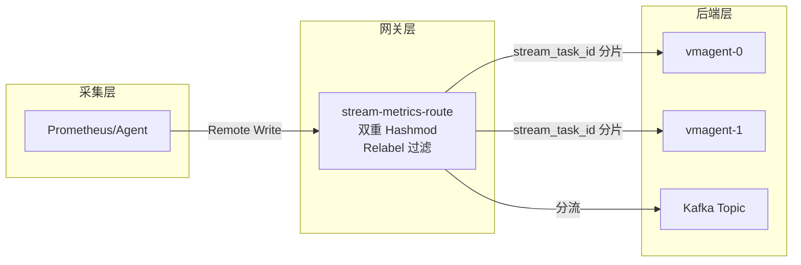

# Stream Metrics Route（指标流路由）

[](https://github.com/mickeyzzc/stream-metrics-route/releases/latest) [](https://goreportcard.com/report/github.com/mickeyzzc/stream-metrics-route)

Stream Metrics Route 是一个高性能指标路由网关，支持 Prometheus Remote Write 协议和 Kafka 分发，具备**双重 Hashmod 调度**确保同维度指标一致路由。

## 文档导航

| 语言 | 文档链接 |
|------|----------|
| English | [docs/README.md](docs/README.md) |
| 中文 | [docs/README_zh.md](docs/README_zh.md) |

详细文档：

- [架构设计（英文）](docs/architecture.md) | [架构设计（中文）](docs/architecture_zh.md)

## 快速开始

### 架构概览



### 源码构建

```bash
git clone https://github.com/mickeyzzc/stream-metrics-route.git
cd stream-metrics-route
go mod tidy
go build -o stream-metrics-route ./cmd/stream-metrics-route
```

### Docker 部署

```bash
docker build -t stream-metrics-route:latest .
docker run -p 8080:8080 -v $(pwd)/config.yaml:/app/config.yaml stream-metrics-route:latest
```

### Kubernetes 部署

```bash
kubectl apply -f examples/manifests/k8s/deploy.yaml
```

## 核心特性

| 特性 | 描述 |
|------|------|
| **双重 Hashmod 调度** | 确保同维度指标路由到同一后端节点 |
| **Prometheus Remote Write** | 原生支持 Prometheus remote write 协议 |
| **Kafka 集成** | 可选 Kafka 生产者实现异步消息分发 |
| **熔断器** | 内置熔断器模式，防止级联故障 |
| **Relabel 规则** | 完整支持 Prometheus relabeling 规则 |
| **Prometheus 指标** | 全面的监控指标，便于可观测性 |

## API 接口

| 端点 | 方法 | 描述 |
|------|------|------|
| `/api/v1/write` | POST | Prometheus remote write 端点 |
| `/metrics` | GET | Prometheus 指标 |
| `/stats` | GET | 路由统计信息 |
| `/-/health` | GET | 健康检查 |
| `/-/ready` | GET | 就绪检查 |

## 配置示例

```yaml
router_rule:
  - router_name: "route-to-vmagent"
    hash_labels:
      mode: "hashmod"
      labels:
        - "__name__"
        - "job"
    up_streams:
      up_streams_type: "RemoteWriter"
      upstream_urls:
        - "http://vmagent-0:8429/api/v1/write"
        - "http://vmagent-1:8429/api/v1/write"

  - router_name: "route-to-kafka"
    up_streams:
      up_streams_type: "Kafka"
      kafka_config:
        kafka_broker_list: "kafka:9092"
        kafka_topic: "metrics"
```

## 项目结构

```
stream-metrics-route/
├── cmd/stream-metrics-route/   # 程序入口
├── pkg/
│   ├── router/                 # 路由核心（双重 hashmod）
│   ├── remote/                 # Remote Write 客户端 + 熔断器
│   ├── kafkaclient/           # Kafka 生产者
│   ├── receive/                # HTTP 接收层
│   └── setting/                # 配置管理
├── docs/                       # 详细文档
│   ├── README.md              # 英文文档
│   ├── README_zh.md           # 中文文档
│   ├── architecture.md         # 架构设计（英文）
│   ├── architecture_zh.md      # 架构设计（中文）
│   └── images/                 # 图片资源
├── examples/manifests/k8s/    # Kubernetes 部署清单
└── Dockerfile
```

## 相关链接

- [详细英文文档](docs/README.md)
- [详细中文文档](docs/README_zh.md)
- [VictoriaMetrics 官方文档](https://docs.victoriametrics.com/)
- [Prometheus Remote Write 规范](https://prometheus.io/docs/prometheus/latest/storage/)
