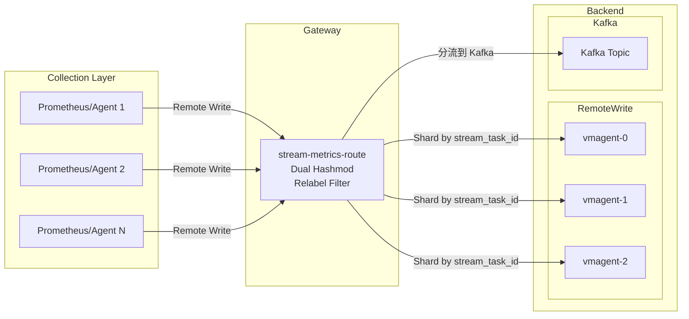
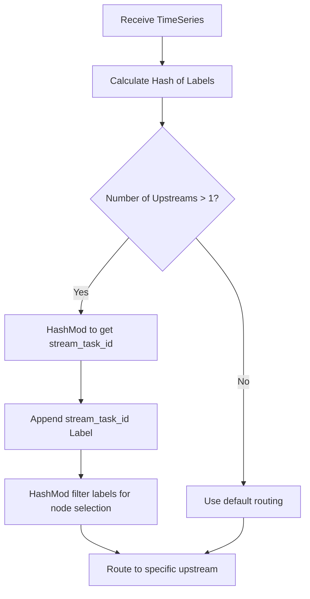

# stream-metrics-route

A high-performance metrics routing gateway with dual hashmod scheduling, supporting Prometheus Remote Write protocol and Kafka distribution.

## Features

- **Dual Hashmod Scheduling**: Ensures metrics with the same dimension are routed to the same backend node
- **Prometheus Remote Write Protocol**: Native support for Prometheus remote write endpoints
- **Kafka Integration**: Optional Kafka producer for asynchronous message distribution
- **Circuit Breaker**: Built-in circuit breaker pattern to prevent cascade failures
- **Relabel Rules**: Full Prometheus relabeling rule support for filtering and routing
- **Prometheus Metrics**: Comprehensive metrics for monitoring and observability
- **Kubernetes Ready**: Docker and Kubernetes deployment manifests included

## Architecture



## Quick Start

### Prerequisites

- Go 1.23+
- Docker (optional)
- Kubernetes cluster (optional)

### Build from Source

```bash
git clone https://github.com/your-repo/stream-metrics-route.git
cd stream-metrics-route
go mod tidy
go build -o stream-metrics-route ./cmd/stream-metrics-route
```

### Docker

```bash
docker build -t stream-metrics-route:latest .
docker run -p 8080:8080 -v $(pwd)/config.yaml:/app/config.yaml stream-metrics-route:latest
```

### Kubernetes

```bash
kubectl apply -f examples/manifests/k8s/deploy.yaml
```

## Configuration

### config.yaml

```yaml
global:
  scrape_interval: 15s

router_rule:
  - router_name: "route-to-vmagent"
    hash_labels:
      mode: "hashmod"
      labels:
        - "__name__"
        - "job"
        - "instance"
    metric_relabel_configs:
      - source_labels: [__name__]
        regex: "http_request.*"
        action: keep
    up_streams:
      up_streams_type: "RemoteWriter"
      upstream_urls:
        - "http://vmagent-0:8429/api/v1/write"
        - "http://vmagent-1:8429/api/v1/write"
        - "http://vmagent-2:8429/api/v1/write"

  - router_name: "route-to-kafka"
    up_streams:
      up_streams_type: "Kafka"
      kafka_config:
        kafka_broker_list: "kafka:9092"
        kafka_topic: "metrics"
        kafka_compression: "snappy"
        batch_num_messages: 1000
        async: true
```

### Command Line Options

| Flag | Default | Description |
|------|---------|-------------|
| `--config.path` | `.` | Configuration file path |
| `--config.name` | `config.yaml` | Configuration file name |
| `--log.level` | `info` | Log level (debug, info, warn, error) |
| `--listen.port` | `8080` | HTTP server port |
| `--max.request.size` | `104857600` | Max request size in bytes (100MB) |
| `--write.timeout` | `30s` | Write timeout duration |

## API Endpoints

| Endpoint | Method | Description |
|----------|--------|-------------|
| `/api/v1/write` | POST | Prometheus remote write endpoint |
| `/api/v1/receive` | POST | Alternative write endpoint |
| `/metrics` | GET | Prometheus metrics |
| `/stats` | GET | Router statistics |
| `/-/health` | GET | Health check |
| `/-/ready` | GET | Readiness check |

### Health Check Response

```bash
curl http://localhost:8080/-/health
```

```json
{
  "code": 2000,
  "msg": "ok",
  "data": null
}
```

### Stats Response

```bash
curl http://localhost:8080/stats
```

```json
{
  "code": 2000,
  "msg": "ok",
  "data": {
    "route-to-vmagent": {
      "name": "route-to-vmagent",
      "state": "closed",
      "total_requests": 1000,
      "success_count": 998,
      "failure_count": 2,
      "circuit_breaker": {
        "state": "closed",
        "failures": 0,
        "successes": 1000,
        "failure_rate": 0
      }
    }
  }
}
```

## Metrics

| Metric | Type | Description |
|--------|------|-------------|
| `stream_receive_request_duration_seconds` | Histogram | Request processing duration |
| `stream_receive_series_total` | Counter | Total time series received |
| `stream_receive_samples_total` | Counter | Total samples received |
| `stream_receive_errors_total` | Counter | Errors by type |
| `stream_router_write_duration_seconds` | Histogram | Router write duration |
| `stream_router_errors_total` | Counter | Router errors |
| `stream_remote_write_timeseries_total` | Counter | Remote write time series |
| `stream_remote_write_failures_total` | Counter | Remote write failures |

## Dual Hashmod Algorithm

The core algorithm ensures consistent routing:



### Example

For metrics with labels `{job="api", instance="host1"}`:

1. Calculate hash: `hash("instance", "host1", "job", "api")`
2. `dimension = 100`, `stream_task_id = hash % 100 = 42`
3. Route based on `stream_task_id` to ensure same metrics always go to same node

## Development

### Run Tests

```bash
go test ./... -v
```

### Build Binary

```bash
make build
```

### Docker Build

```bash
make docker-build
```

## Contributing

Contributions are welcome! Please feel free to submit a Pull Request.

## License

This project is licensed under the MIT License - see the [LICENSE](LICENSE) file for details.
