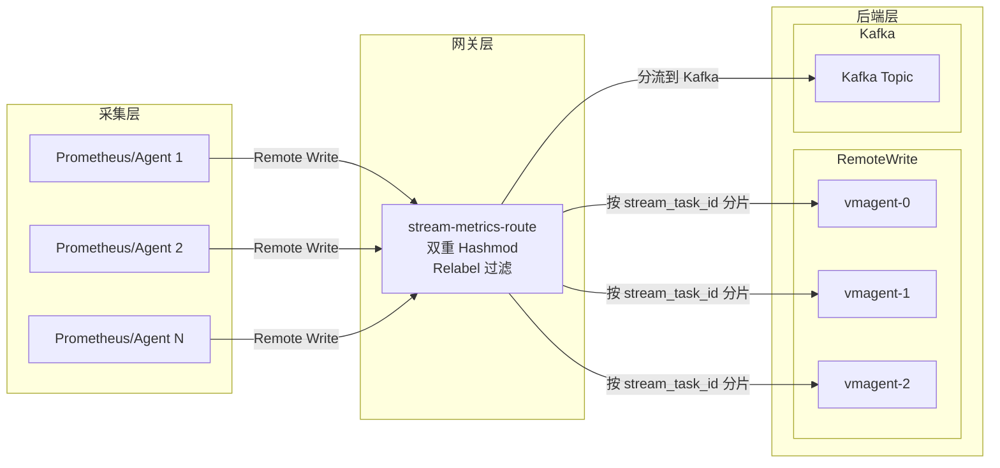
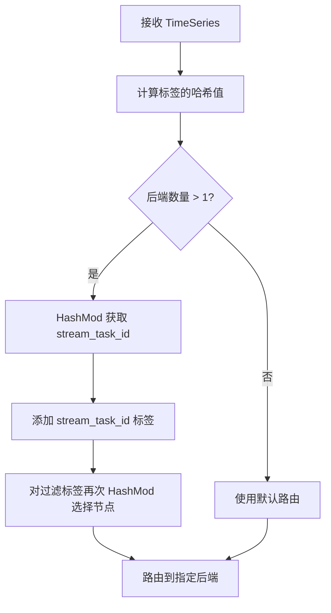

# stream-metrics-route

高性能指标路由网关，支持双重 hashmod 调度、Prometheus Remote Write 协议和 Kafka 分发。

## 特性

- **双重 Hashmod 调度**：确保同维度指标路由到同一后端节点
- **Prometheus Remote Write 协议**：原生支持 Prometheus remote write 端点
- **Kafka 集成**：可选 Kafka 生产者实现异步消息分发
- **熔断器**：内置熔断器模式，防止级联故障
- **Relabel 规则**：完整支持 Prometheus relabeling 规则进行过滤和路由
- **Prometheus 指标**：全面的监控指标，便于可观测性
- **Kubernetes 就绪**：包含 Docker 和 Kubernetes 部署清单

## 架构图



## 快速开始

### 前置条件

- Go 1.23+
- Docker（可选）
- Kubernetes 集群（可选）

### 从源码构建

```bash
git clone https://github.com/your-repo/stream-metrics-route.git
cd stream-metrics-route
go mod tidy
go build -o stream-metrics-route ./cmd/stream-metrics-route
```

### Docker 部署

```bash
docker build -t stream-metrics-route:latest .
docker run -p 8080:8080 -v $(pwd)/config.yaml:/app/config.yaml stream-metrics-route:latest
```

### Kubernetes 部署

```bash
kubectl apply -f examples/manifests/k8s/deploy.yaml
```

## 配置说明

### config.yaml 配置示例

```yaml
global:
  scrape_interval: 15s

router_rule:
  - router_name: "route-to-vmagent"
    hash_labels:
      mode: "hashmod"
      labels:
        - "__name__"
        - "job"
        - "instance"
    metric_relabel_configs:
      - source_labels: [__name__]
        regex: "http_request.*"
        action: keep
    up_streams:
      up_streams_type: "RemoteWriter"
      upstream_urls:
        - "http://vmagent-0:8429/api/v1/write"
        - "http://vmagent-1:8429/api/v1/write"
        - "http://vmagent-2:8429/api/v1/write"

  - router_name: "route-to-kafka"
    up_streams:
      up_streams_type: "Kafka"
      kafka_config:
        kafka_broker_list: "kafka:9092"
        kafka_topic: "metrics"
        kafka_compression: "snappy"
        batch_num_messages: 1000
        async: true
```

### 命令行参数

| 参数 | 默认值 | 描述 |
|------|--------|------|
| `--config.path` | `.` | 配置文件路径 |
| `--config.name` | `config.yaml` | 配置文件名 |
| `--log.level` | `info` | 日志级别 (debug, info, warn, error) |
| `--listen.port` | `8080` | HTTP 服务端口 |
| `--max.request.size` | `104857600` | 最大请求大小（字节，100MB） |
| `--write.timeout` | `30s` | 写入超时时间 |

## API 接口

| 端点 | 方法 | 描述 |
|------|------|------|
| `/api/v1/write` | POST | Prometheus remote write 端点 |
| `/api/v1/receive` | POST | 备用写入端点 |
| `/metrics` | GET | Prometheus 指标 |
| `/stats` | GET | 路由统计信息 |
| `/-/health` | GET | 健康检查 |
| `/-/ready` | GET | 就绪检查 |

### 健康检查

```bash
curl http://localhost:8080/-/health
```

响应示例：

```json
{
  "code": 2000,
  "msg": "ok",
  "data": null
}
```

### 统计信息

```bash
curl http://localhost:8080/stats
```

响应示例：

```json
{
  "code": 2000,
  "msg": "ok",
  "data": {
    "route-to-vmagent": {
      "name": "route-to-vmagent",
      "state": "closed",
      "total_requests": 1000,
      "success_count": 998,
      "failure_count": 2,
      "circuit_breaker": {
        "state": "closed",
        "failures": 0,
        "successes": 1000,
        "failure_rate": 0
      }
    }
  }
}
```

## 监控指标

| 指标名称 | 类型 | 描述 |
|----------|------|------|
| `stream_receive_request_duration_seconds` | Histogram | 请求处理时长 |
| `stream_receive_series_total` | Counter | 接收的时间序列总数 |
| `stream_receive_samples_total` | Counter | 接收的样本总数 |
| `stream_receive_errors_total` | Counter | 按类型统计的错误数 |
| `stream_router_write_duration_seconds` | Histogram | 路由写入时长 |
| `stream_router_errors_total` | Counter | 路由错误数 |
| `stream_remote_write_timeseries_total` | Counter | Remote write 时间序列数 |
| `stream_remote_write_failures_total` | Counter | Remote write 失败数 |

## 双重 Hashmod 算法

核心算法确保一致的路由：



### 算法示例

对于标签为 `{job="api", instance="host1"}` 的指标：

1. 计算哈希：`hash("instance", "host1", "job", "api")`
2. `dimension = 100`，`stream_task_id = hash % 100 = 42`
3. 根据 `stream_task_id` 路由，确保相同指标始终发送到同一节点

## 开发指南

### 运行测试

```bash
go test ./... -v
```

### 构建二进制

```bash
make build
```

### Docker 构建

```bash
make docker-build
```

## 项目结构

```
stream-metrics-route/
├── cmd/
│   └── stream-metrics-route/
│       └── main.go              # 程序入口
├── pkg/
│   ├── common/                  # 通用工具
│   │   └── relabel.go           # Relabel 处理
│   ├── fasttime/                # 时间工具
│   ├── kafkaclient/             # Kafka 客户端
│   │   ├── kafka.go             # Kafka 生产者
│   │   ├── serializers.go        # 序列化器
│   │   └── telemetry.go         # Kafka 指标
│   ├── receive/                 # HTTP 接收层
│   │   ├── receive.go           # 请求处理器
│   │   └── telemetry.go         # 接收指标
│   ├── remote/                  # Remote Write
│   │   ├── circuitbreaker.go    # 熔断器
│   │   ├── remotecluster.go     # 集群客户端
│   │   ├── remotewrite.go       # Remote Write 客户端
│   │   └── telemetry.go         # Remote 指标
│   ├── router/                  # 路由层
│   │   ├── router.go            # 路由核心
│   │   └── telemetry.go         # 路由指标
│   ├── setting/                 # 配置
│   │   ├── config.go            # 配置结构
│   │   └── kafka.go            # Kafka 配置
│   └── telemetry/               # 可观测性
│       ├── logger.go            # 日志
│       └── prometheus.go       # Prometheus 注册
├── docs/                        # 文档
│   ├── README.md                # 英文文档
│   ├── README_zh.md             # 中文文档
│   └── images/                  # 图片资源
├── examples/
│   └── manifests/
│       └── k8s/
│           └── deploy.yaml      # K8s 部署清单
├── Dockerfile
├── Makefile
└── go.mod
```

## 贡献指南

欢迎提交 Pull Request！请确保：

1. 代码通过 `go fmt` 和 `go vet` 检查
2. 添加了必要的单元测试
3. 更新了相关文档

## 许可证

本项目采用 MIT 许可证 - 详见 [LICENSE](LICENSE) 文件。
