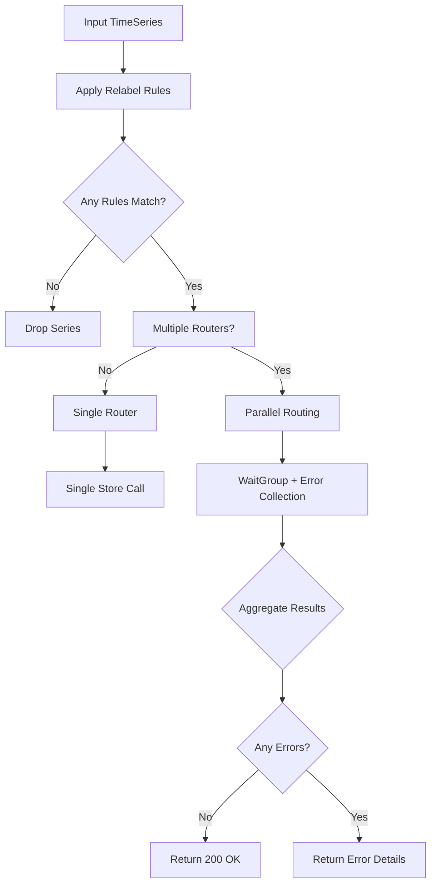
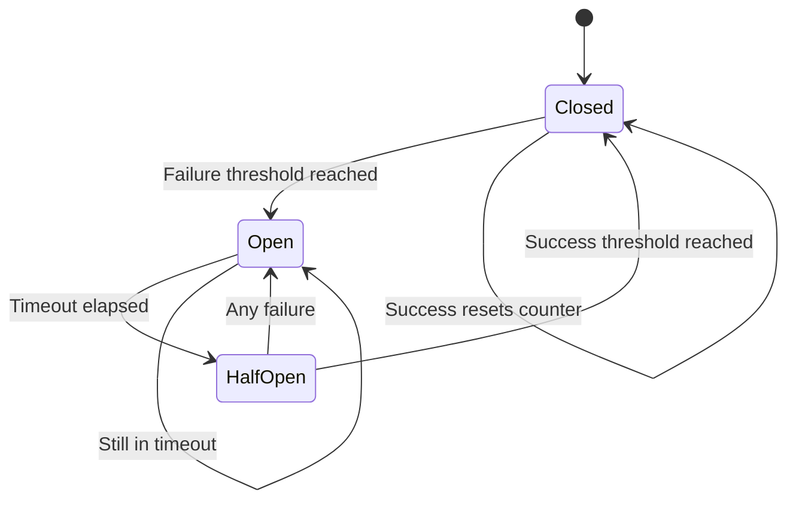
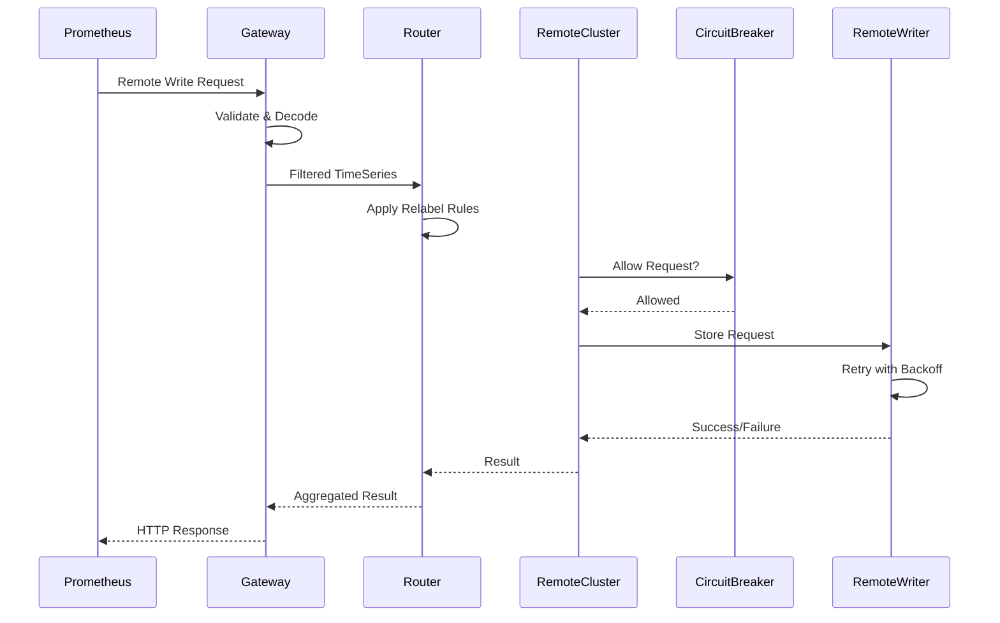

# Architecture Design

## Overview

stream-metrics-route is a high-performance metrics routing gateway designed to solve the high-cardinality metric distribution problem in large-scale Prometheus/VictoriaMetrics deployments.

## Problem Statement

When deploying Prometheus in high-throughput scenarios, common challenges include:

1. **High Cardinality Metrics**: Services like `istio_request_total` can generate millions of unique time series
2. **Distribution Requirements**: Same metrics must be routed to the same processing node for accurate aggregation
3. **Backend Diversity**: Different metrics may need to route to different backends (vmagent, Kafka, etc.)
4. **Reliability**: Circuit breaker and retry mechanisms are needed for backend failures

## Solution Architecture

```mermaid
flowchart TB
    subgraph Clients
        P[Prometheus]
        AG[Prometheus Agent]
        APP[Application SDK]
    end

    subgraph Gateway
        direction TB
        HTTP[HTTP Handler<br/>Snappy Decode]
        VALIDATE[Validation<br/>Size Limit]
        RELABEL[Relabel Filter]
        #QP|        ROUTE[Router<br/>Jump Consistent Hash]
    end

    subgraph Backends
        subgraph RemoteWrite
            VM0[vmagent-0]
            VM1[vmagent-1]
            VM2[vmagent-2]
            VMS[(VictoriaMetrics<br/>Cluster)]
        end
        subgraph Kafka
            KAFKA[Kafka Cluster]
            CONS[Consumer]
        end
    end

    P -->|Remote Write| HTTP
    AG -->|Remote Write| HTTP
    APP -->|Remote Write| HTTP

    HTTP --> VALIDATE
    VALIDATE --> RELABEL
    RELABEL --> ROUTE

    ROUTE -->|stream_task_id=0| VM0
    ROUTE -->|stream_task_id=1| VM1
    ROUTE -->|stream_task_id=2| VM2
    ROUTE -->|filtered metrics| KAFKA

    VM0 --> VMS
    VM1 --> VMS
    VM2 --> VMS
    KAFKA --> CONS
```

## Core Components

### 1. HTTP Handler (`pkg/receive/`)

Handles incoming Prometheus Remote Write requests:

- **Snappy Decompression**: Decodes snappy-compressed protobuf data
- **Request Validation**: Enforces size limits and timeouts
- **Metrics Tracking**: Records series and sample counts

```go
// Key flow
func (r *Receive) Handler() func(*gin.Context) {
    return func(c *gin.Context) {
        // 1. Read with size limit
        limitedReader := io.LimitReader(c.Request.Body, r.MaxSize)
        compressed, _ := io.ReadAll(limitedReader)

        // 2. Snappy decode
        reqBuf, _ := snappy.Decode(nil, compressed)

        // 3. Protobuf unmarshal
        var req prompb.WriteRequest
        proto.Unmarshal(reqBuf, &req)

        // 4. Route with timeout
        ctx, cancel := context.WithTimeout(c.Request.Context(), r.Timeout)
        defer cancel()
        router.Store(ctx, req.Timeseries)
    }
}
```

### 2. Router (`pkg/router/`)

#NY|Implements the routing logic with dual Jump Consistent Hash:



### 3. Remote Cluster (`pkg/remote/`)

Manages connections to multiple Remote Write endpoints:

#SH|- **Jump Consistent Hash Routing**: Consistent hashing based on metric labels
- **Circuit Breaker**: Prevents cascade failures
- **Retry Logic**: Exponential backoff for transient failures

### 4. Circuit Breaker (`pkg/remote/circuitbreaker.go`)

Implements the circuit breaker pattern:



#PH|## Dual Jump Consistent Hash Algorithm

#MQ|The dual Jump Consistent Hash algorithm solves the problem of ensuring same metrics go to the same processing node:

### Step 1: Task ID Assignment

```go
// Calculate hash of all labels
hash := sortLabelsHashKey(ts.Labels)

#RB|// First Jump Hash: assign task partition ID
#TN|dime := common.JumpConsistentHash(uint64(hash), r.dimension)  // dimension typically = 100

// Inject stream_task_id label
ts.Labels = append(ts.Labels, prompb.Label{
    Name:  "stream_task_id",
    Value: fmt.Sprintf("%d", dime),
})
```

### Step 2: Node Selection

```go
// Calculate hash with filtered labels only
hashnode := sortLabelsHashKey(filterLabels)

#ZM|// Second Jump Hash: select backend node
#PM|tmpch := common.JumpConsistentHash(uint64(hashnode), r.uplen)

// Route to specific upstream
sendSamplesChan[tmpch] = append(sendSamplesChan[tmpch], ts)
```

#YX|### Why Dual Jump Consistent Hash?

#SZ|| Scenario | Single Hash | Dual Jump Hash |
|----------|---------------|--------------|
| Same metric, different instances | Routes to different nodes | Routes to same node (by task_id) |
| Node count change | Shuffles all metrics | Only affects routing, not task assignment |
| Task scaling | All metrics re-route | Only new task boundaries affected |

## Data Flow



## Reliability Features

### 1. Request Size Limiting

```go
const maxRequestSize = 100 * 1024 * 1024 // 100MB

limitedReader := io.LimitReader(c.Request.Body, maxRequestSize)
```

### 2. Write Timeout

```go
ctx, cancel := context.WithTimeout(c.Request.Context(), 30*time.Second)
defer cancel()
router.Store(ctx, req.Timeseries)
```

### 3. Circuit Breaker

| Parameter | Default | Description |
|-----------|---------|-------------|
| Failure Threshold | 5 | Open circuit after 5 consecutive failures |
| Success Threshold | 3 | Close circuit after 3 successes in half-open |
| Timeout | 30s | Time before attempting to close circuit |

### 4. Retry with Exponential Backoff

```go
for attempt := 0; attempt <= maxRetries; attempt++ {
    if attempt > 0 {
        backoff = time.Duration(math.Min(float64(backoff*2), float64(maxBackoff)))
        time.Sleep(backoff)
    }
    err := store(ctx, data)
    if err == nil {
        return nil
    }
}
```

## Performance Considerations

### Parallel Processing

- Router uses goroutines for parallel backend writes
- WaitGroup ensures all writes complete before returning
- Errors are collected and reported

### Memory Efficiency

- Relabel filters reduce unnecessary data early
- Batch processing for Kafka writes
- Connection pooling for HTTP clients

### Monitoring

Key metrics for performance tuning:

- `stream_router_write_duration_seconds`: Latency per router
- `stream_remote_write_timeseries_total`: Throughput
- `stream_remote_write_failures_total`: Error rate
