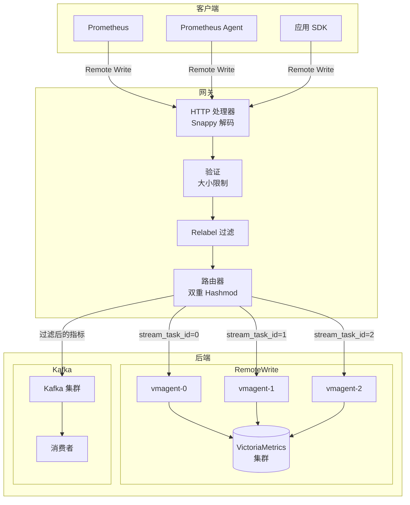
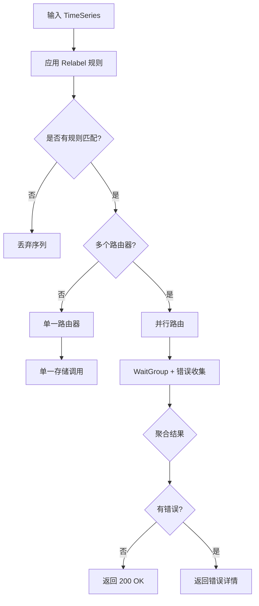
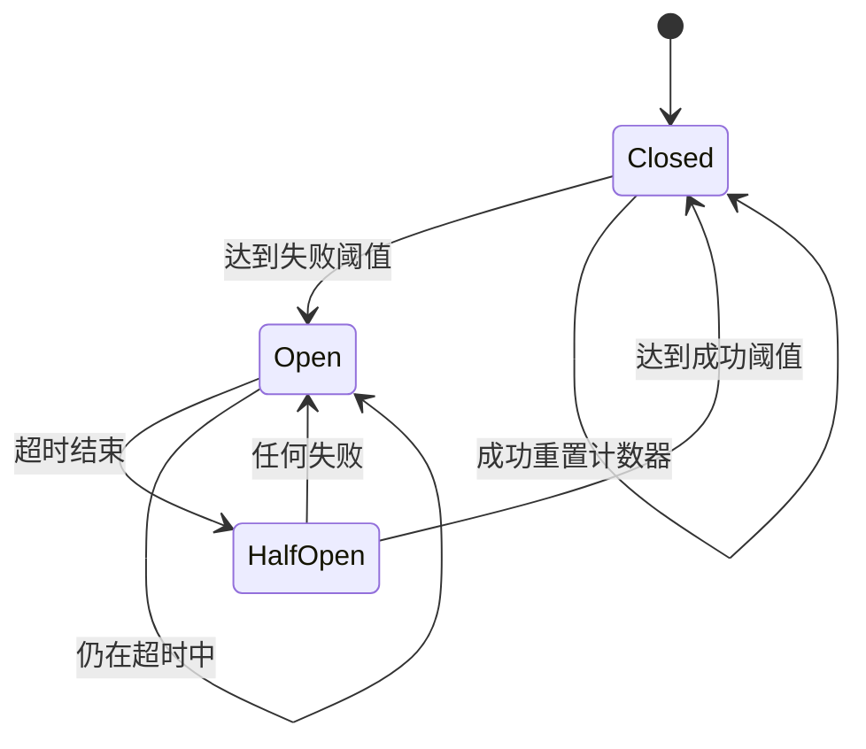
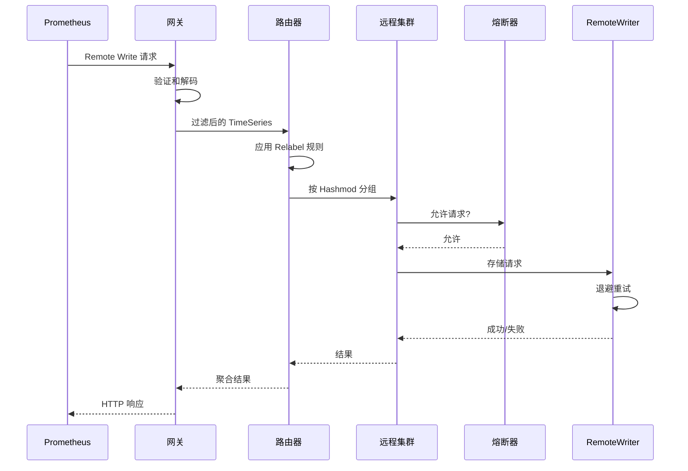

# 架构设计

## 概述

stream-metrics-route 是一个高性能指标路由网关，旨在解决大规模 Prometheus/VictoriaMetrics 部署中的高基数指标分发问题。

## 问题背景

在大规模 Prometheus 高吞吐场景中，常见挑战包括：

1. **高基数指标**：如 `istio_request_total` 等服务可能产生数百万个独特时间序列
2. **一致性路由需求**：相同维度指标必须路由到同一处理节点才能准确聚合
3. **后端多样性**：不同指标可能需要路由到不同后端（vmagent、Kafka 等）
4. **可靠性**：后端故障时需要熔断器和重试机制

## 解决方案架构



## 核心组件

### 1. HTTP 处理器 (`pkg/receive/`)

处理传入的 Prometheus Remote Write 请求：

- **Snappy 解压缩**：解码 snappy 压缩的 protobuf 数据
- **请求验证**：强制执行大小限制和超时
- **指标追踪**：记录时间序列和样本数量

### 2. 路由器 (`pkg/router/`)

实现带双重 hashmod 的路由逻辑：



### 3. 远程集群客户端 (`pkg/remote/`)

管理到多个 Remote Write 端点的连接：

- **Hashmod 路由**：基于指标标签的一致性哈希
- **熔断器**：防止级联故障
- **重试逻辑**：对临时故障进行指数退避重试

### 4. 熔断器 (`pkg/remote/circuitbreaker.go`)

实现熔断器模式：



## 双重 Hashmod 算法

双重 hashmod 算法解决确保相同指标发送到同一处理节点的问题：

### 第一步：任务 ID 分配

```go
// 计算所有标签的哈希
hash := sortLabelsHashKey(ts.Labels)

// 第一次 hashmod：分配任务分区 ID
dime := hashMod(r.dimension, hash)  // dimension 通常 = 100

// 注入 stream_task_id 标签
ts.Labels = append(ts.Labels, prompb.Label{
    Name:  "stream_task_id",
    Value: fmt.Sprintf("%d", dime),
})
```

### 第二步：节点选择

```go
// 仅使用过滤标签计算哈希
hashnode := sortLabelsHashKey(filterLabels)

// 第二次 hashmod：选择后端节点
tmpch := hashMod(r.uplen, hashnode)

// 路由到特定后端
sendSamplesChan[tmpch] = append(sendSamplesChan[tmpch], ts)
```

### 为什么需要双重 Hashmod？

| 场景 | 单一 Hashmod | 双重 Hashmod |
|------|-------------|--------------|
| 相同指标，不同实例 | 路由到不同节点 | 路由到同一节点（按 task_id） |
| 节点数量变化 | 所有指标重新分配 | 仅影响路由，不影响任务分配 |
| 任务扩容 | 所有指标重新路由 | 仅新任务边界受影响 |

## 数据流



## 可靠性特性

### 1. 请求大小限制

```go
const maxRequestSize = 100 * 1024 * 1024 // 100MB

limitedReader := io.LimitReader(c.Request.Body, maxRequestSize)
```

### 2. 写入超时

```go
ctx, cancel := context.WithTimeout(c.Request.Context(), 30*time.Second)
defer cancel()
router.Store(ctx, req.Timeseries)
```

### 3. 熔断器

| 参数 | 默认值 | 描述 |
|------|--------|------|
| 失败阈值 | 5 | 连续 5 次失败后打开熔断器 |
| 成功阈值 | 3 | 半开状态下 3 次成功后关闭熔断器 |
| 超时时间 | 30s | 尝试关闭熔断器前等待的时间 |

### 4. 指数退避重试

```go
for attempt := 0; attempt <= maxRetries; attempt++ {
    if attempt > 0 {
        backoff = time.Duration(math.Min(float64(backoff*2), float64(maxBackoff)))
        time.Sleep(backoff)
    }
    err := store(ctx, data)
    if err == nil {
        return nil
    }
}
```

## 性能考虑

### 并行处理

- 路由器使用 goroutine 进行并行后端写入
- WaitGroup 确保所有写入完成后再返回
- 错误被收集并报告

### 内存效率

- Relabel 过滤器在早期减少不必要的数据
- Kafka 写入的批处理
- HTTP 客户端的连接池

### 监控指标

用于性能调优的关键指标：

- `stream_router_write_duration_seconds`：每个路由器的延迟
- `stream_remote_write_timeseries_total`：吞吐量
- `stream_remote_write_failures_total`：错误率
